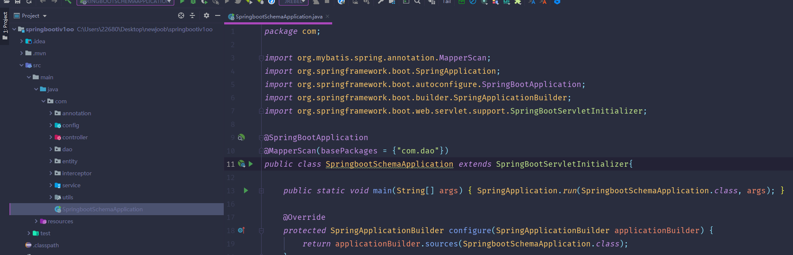
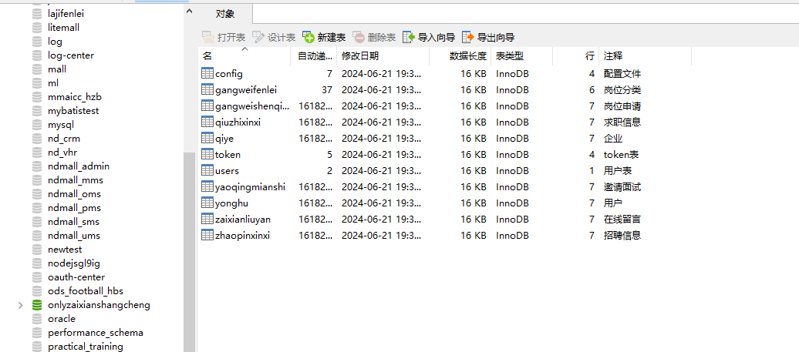
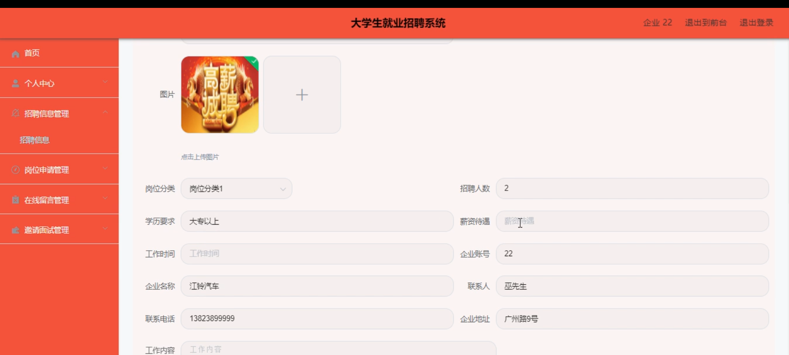

# 基于springboot的大学生就业招聘系统

---
### 👉作者QQ ：1556708905 微信：zheng0123Long (支持定制修改、部署调试、定制毕设)

### 👉接网站建设、小程序、H5、APP、各种系统等

---

#### 介绍

随着高校毕业生人数的逐年增长，就业市场竞争日益激烈。尽管现有的招聘平台为大学生和企业提供了一定的便利，但仍然存在信息分散、匹配效率不高等问题。本研究旨在开发一个基于Spring Boot的大学生就业招聘系统，以填补当前市场在信息整合和高效匹配方面的空白，为大学生和企业提供一个更加便捷、高效的求职与招聘平台。

#### 技术栈

后端技术栈：Springboot+Mysql+Maven

前端技术栈：Vue+Html+Css+Javascript+ElementUI

开发工具：Idea+Vscode+Navicate

#### 系统功能介绍

 管理端

管理端是系统的核心管理者，负责整个系统的日常运营和维护。主要功能模块包括：

个人中心：管理员可以查看和修改自己的个人信息。  
用户管理：管理所有注册用户的账号信息，包括大学生和企业的信息。  
企业管理：审核、管理和维护企业用户的资质和信息。  
岗位分类管理：设置和管理各类岗位的分类，方便用户搜索和筛选。  
招聘信息管理：审核、发布和管理企业发布的招聘信息。  
岗位申请管理：查看、处理大学生提交的岗位申请。  
在线留言管理：查看、回复和处理用户和企业之间的留言。  
求职信息管理：查看和管理大学生发布的求职信息。  
邀请面试管理：协助企业向大学生发送面试邀请，并管理面试状态。  
管理员管理：添加、修改和删除管理员账号。  
系统管理：包括系统配置、数据备份、日志查看等高级管理功能。  

2. 企业端

企业端是企业在系统上的操作界面，主要功能包括：

发布招聘信息：企业可以发布自己的招聘信息，包括职位、要求、待遇等。    
求职信息管理：查看大学生发布的求职信息，与符合条件的求职者取得联系。
个人中心：查看和修改企业的基本信息。  
后台管理：  
招聘信息管理：编辑、删除或重新发布招聘信息。  
岗位申请管理：查看和管理大学生提交的岗位申请，与求职者沟通。  
在线留言管理：查看和回复用户的留言。  
邀请面试管理：向符合条件的求职者发送面试邀请，并管理面试状态。
  
3. 用户端（大学生端）

用户端是大学生在系统上的操作界面，主要功能包括：

查看招聘信息：浏览企业发布的各类招聘信息。  
发布求职信息：发布自己的求职信息，包括教育背景、技能、期望职位等。  
个人中心：查看和修改自己的个人信息。  
后台管理：  
岗位申请管理：向心仪的职位提交申请，并查看申请状态。  
在线留言管理：向企业发送留言，并查看回复。  
求职信息管理：编辑或删除自己发布的求职信息。  
邀请面试管理：查看企业发送的面试邀请，并管理面试状态。  
#### 系统作用

对大学生的作用

提供丰富的招聘信息，帮助大学生了解就业市场动态。  
便捷的岗位申请流程，提高求职效率。  
在线留言和面试邀请功能，增强与企业的沟通机会。  

2. 对企业的作用 

高效的招聘信息发布平台，降低招聘成本。  
便于筛选和管理求职信息，提高招聘效率。  
在线留言和面试邀请功能，增强与求职者的沟通互动。  

3. 对管理员的作用

全面的系统管理功能，确保系统的稳定运行。  
高效的用户和企业管理，维护平台的秩序和质量。  
实时查看和处理招聘与求职信息，促进信息的高效匹配。  

#### 系统功能截图

代码结构

数据库表

登录

个人中心

首页

招聘信息

后台管理

企业端招聘信息管理

在线留言

管理端页面

#### 总结

大学生就业招聘系统是一个功能全面、操作便捷的在线招聘平台。通过整合招聘信息和求职信息，该系统为大学生和企业提供了一个高效的求职与招聘环境。同时，管理员通过全面的管理功能，确保系统的稳定运行和信息的高效匹配。该系统不仅提高了大学生的求职效率和企业的招聘效率，还有助于解决就业市场中的信息不对称问题，促进大学生就业和企业招聘的高效对接。

#### 使用说明

创建数据库，执行数据库脚本 修改jdbc数据库连接参数 下载安装maven依赖jar 启动idea中的springboot项目

后台地址：http://localhost:8080/springbootiv1oo/admin/dist/index.html

管理员  abo 密码 abo

前台地址：http://localhost:8080/springbootiv1oo/front/index.html

